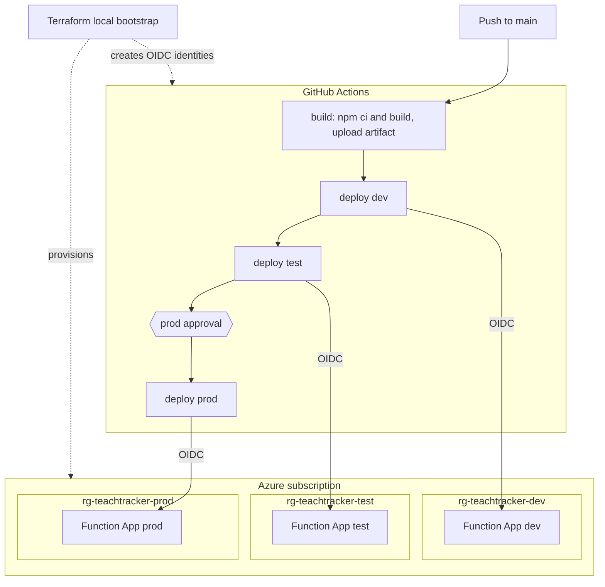
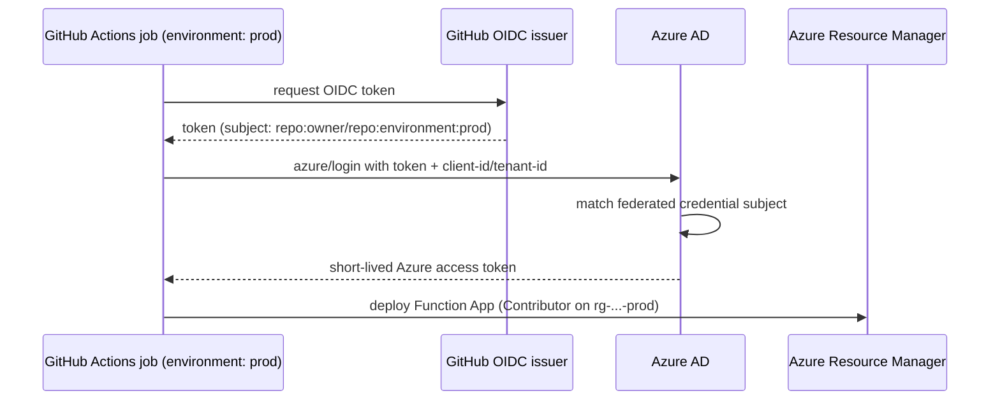

# Deployment & Infrastructure

How **func-teaching-tracker** is provisioned and deployed to Azure across three
environments (`dev`, `test`, `prod`) using Terraform and GitHub Actions.

- Infrastructure as code: [infra/terraform/](../infra/terraform/)
- Pipeline: [.github/workflows/deploy.yml](../.github/workflows/deploy.yml) +
  [deploy-env.yml](../.github/workflows/deploy-env.yml)
- Contributor workflow: [CONTRIBUTING.md](../CONTRIBUTING.md)

## Architecture



Key idea: **build once, promote the same artifact** through dev → test → prod.
Each environment is a fully isolated Azure resource group with its own Function App
and its own CI identity. No long-lived secrets are stored anywhere — GitHub Actions
authenticates to Azure with short-lived **OIDC** tokens.

## Environments

| Environment | Resource group        | Trigger                      | Scale (max instances) |
| ----------- | --------------------- | ---------------------------- | --------------------- |
| `dev`       | `rg-teachtracker-dev`  | auto, on push to `main`      | 40                    |
| `test`      | `rg-teachtracker-test` | auto, after `dev` succeeds   | 40                    |
| `prod`      | `rg-teachtracker-prod` | after `test` **+ approval**  | 100                   |

Environments are defined by the `environments` map in
[infra/terraform/variables.tf](../infra/terraform/variables.tf). The map keys
(`dev`/`test`/`prod`) are the contract: they must match the GitHub Environment names
in the workflow and the OIDC federated-credential subjects.

## Azure resources (per environment)

Provisioned by the [function_app](../infra/terraform/modules/function_app) module:

| Resource                     | Name pattern                        | Purpose                       |
| ---------------------------- | ----------------------------------- | ----------------------------- |
| Resource group               | `rg-teachtracker-<env>`             | Isolation boundary            |
| Storage account              | `stteachtracker<env><rand>`         | Runtime + deployment packages |
| Blob container               | `deployments`                       | Flex Consumption deploy store |
| Log Analytics workspace      | `log-teachtracker-<env>`            | Logs backend                  |
| Application Insights         | `appi-teachtracker-<env>`           | Telemetry / monitoring        |
| Service plan (`FC1`)         | `plan-teachtracker-<env>`           | Flex Consumption hosting      |
| Function App (Linux, Node)   | `func-teachtracker-<env>-<rand>`    | The API                       |

The [github_oidc](../infra/terraform/modules/github_oidc) module adds, per env: an
Azure AD app registration, a federated credential, and a `Contributor` role
assignment scoped to that environment's resource group.

## CI/CD pipeline

Defined in [deploy.yml](../.github/workflows/deploy.yml) (orchestrator) and
[deploy-env.yml](../.github/workflows/deploy-env.yml) (reusable per-env deploy).

1. **build** — `npm ci`, `npm run build`, prune dev dependencies, then upload the
   deployment package (`dist`, prod `node_modules`, `host.json`, `package.json`,
   `.funcignore`) as a workflow artifact.
2. **dev** → **test** → **prod** — each job downloads that same artifact, logs into
   Azure via OIDC using the target environment's variables, and deploys with
   `Azure/functions-action`. Jobs are chained with `needs:`, so a failure stops
   promotion.
3. **prod approval** — enforced by the GitHub Environment protection rule on `prod`
   (a required reviewer), not by YAML. Configure it once in the GitHub UI.

### How OIDC auth works (no secrets)



The federated credential Terraform creates for each environment trusts exactly the
subject `repo:<owner>/<repo>:environment:<env>`. Because the deploy job sets
`environment: <env>`, GitHub mints a token with that subject and Azure accepts it.

### Pipeline configuration values

Stored as **GitHub Environment variables** (not secrets), set by
[configure-github-environments.sh](../infra/scripts/configure-github-environments.sh):

| Variable                 | Source (Terraform output)          |
| ------------------------ | ---------------------------------- |
| `AZURE_CLIENT_ID`        | `azure_client_ids[<env>]`          |
| `AZURE_TENANT_ID`        | `azure_tenant_id`                  |
| `AZURE_SUBSCRIPTION_ID`  | `azure_subscription_id`            |
| `AZURE_FUNCTIONAPP_NAME` | `function_app_names[<env>]`        |

## Bootstrap runbook

One-time setup (needs `az`, `terraform`, `gh`, `jq`, and Owner/UAA rights in the
subscription):

```bash
# 1. Authenticate to Azure
az login
az account set --subscription "<your-subscription-id>"

# 2. Provision all three environments + OIDC identities
cd infra/terraform
terraform init
terraform apply                         # review the plan, then "yes"

# 3. Create GitHub Environments and set their variables from the outputs
cd ../..
./infra/scripts/configure-github-environments.sh

# 4. Add a required reviewer to the prod environment (one time)
#    GitHub -> repo Settings -> Environments -> prod -> Required reviewers

# 5. Deploy
git push                                # build -> dev -> test -> prod (approve)
```

## Common operations

- **Add an environment** (e.g. `staging`): add an entry to the `environments` map,
  `terraform apply`, re-run the configure script, and add a `staging` job to
  `deploy.yml` in the promotion chain.
- **Change region or scale** for an environment: edit its entry in the
  `environments` map (`location`, `maximum_instance_count`, `instance_memory_in_mb`)
  and `terraform apply`.
- **Pin a Node version** per environment: set `node_version` (e.g. `"22"`) for that
  env if `24` isn't available in its region.
- **Roll back**: re-run the workflow on an older commit, or redeploy that commit's
  artifact. Infrastructure changes roll back via `git revert` + `terraform apply`.
- **Tear down everything**: `cd infra/terraform && terraform destroy`.

## Troubleshooting

| Symptom                                              | Likely cause / fix                                                                 |
| ---------------------------------------------------- | ---------------------------------------------------------------------------------- |
| `azure/login` fails with `AADSTS700213` / no match   | Job `environment:` doesn't match the federated subject, or variables not set.      |
| `terraform apply` errors on unsupported Node version | Set `node_version` to `22`/`20` for that env in `terraform.tfvars`.                |
| `terraform apply` fails creating the app registration | Your account lacks app-registration / role-assignment rights (need Owner or UAA). |
| prod deploys without waiting                          | Add a **Required reviewer** to the `prod` GitHub Environment.                       |
| Deploy succeeds but functions 404                     | Ensure `AzureWebJobsFeatureFlags=EnableWorkerIndexing` (set by Terraform).          |
