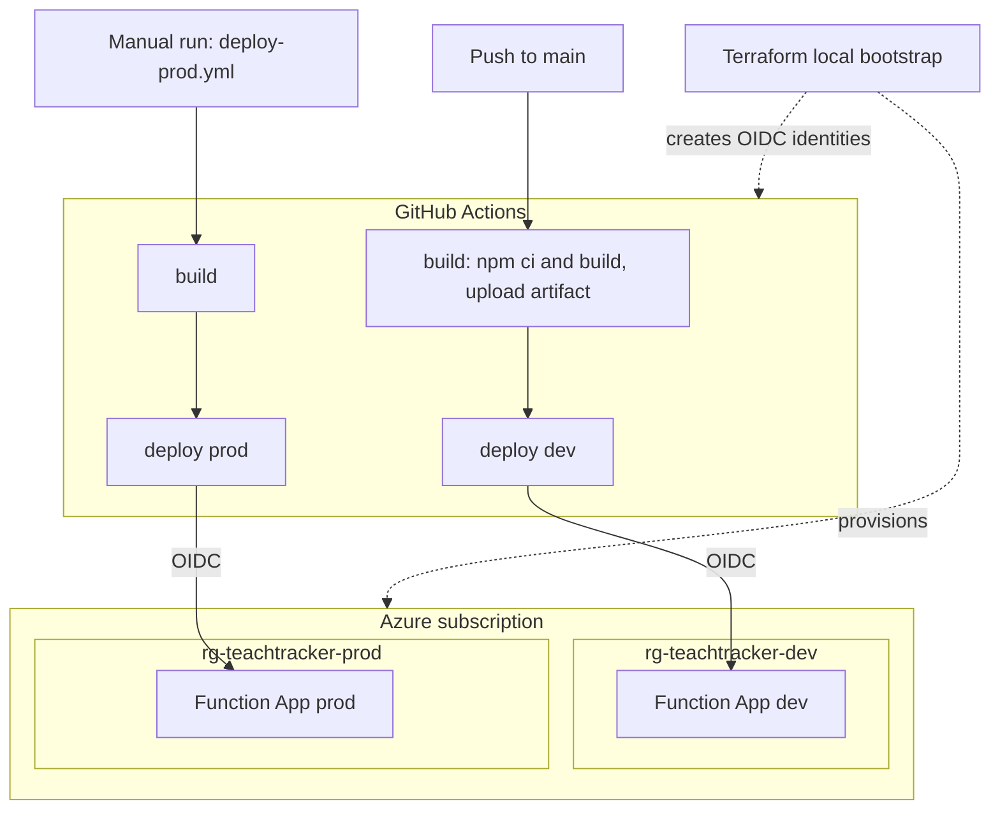
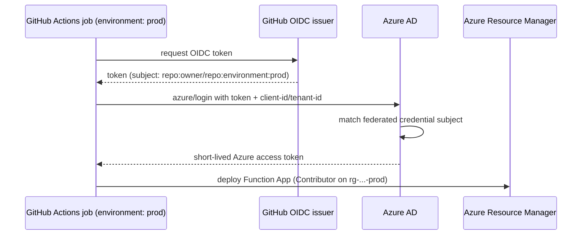

# Deployment & Infrastructure

How **func-teaching-tracker** is provisioned and deployed to Azure across two
environments (`dev`, `prod`) using Terraform and GitHub Actions.

- Infrastructure as code: [infra/terraform/](../infra/terraform/)
- Pipeline: [.github/workflows/deploy.yml](../.github/workflows/deploy.yml) +
  [deploy-env.yml](../.github/workflows/deploy-env.yml)
- Contributor workflow: [CONTRIBUTING.md](../CONTRIBUTING.md)

## Architecture



Key idea: **build once, deploy that artifact** to dev. Each
environment is a fully isolated Azure resource group with its own Function App and
its own CI identity. No long-lived secrets are stored anywhere — GitHub Actions
authenticates to Azure with short-lived **OIDC** tokens.

## Environments

| Environment | Resource group         | Trigger                     | Scale (max instances) |
| ----------- | ---------------------- | --------------------------- | --------------------- |
| `dev`       | `rg-teachtracker-dev`  | auto, on push to `main`     | 40                    |
| `prod`      | `rg-teachtracker-prod` | **manual** (`deploy-prod.yml`) | 100                |

### Hosted URLs

| Env    | API base URL                                                | Function App                    | Allowed frontend origin (CORS)                            |
| ------ | ----------------------------------------------------------- | ------------------------------- | --------------------------------------------------------- |
| `dev`  | https://func-teachtracker-dev-pjlmrq.azurewebsites.net/api   | `func-teachtracker-dev-pjlmrq`  | https://kind-sea-093f96a0f.7.azurestaticapps.net   |
| `prod` | https://func-teachtracker-prod-gjvecw.azurewebsites.net/api  | `func-teachtracker-prod-gjvecw` | https://nice-sea-095463c0f.7.azurestaticapps.net           |

Subscription `e16bea76-64f0-45a5-ae4a-53701ff61801` · Tenant `d2fa8fd6-d1f2-4ac4-bcf5-e8dd34885bb3`

Environments are defined by the `environments` map in
[infra/terraform/variables.tf](../infra/terraform/variables.tf). The map keys
(`dev`/`prod`) are the contract: they must match the GitHub Environment names
in the workflow, the OIDC federated-credential subjects, and the `ENVIRONMENT` app
setting that selects the seed dataset.

### Per-environment data

The `ENVIRONMENT` app setting (set by Terraform) selects the dataset, so each env
serves distinct people and volumes — see [`src/data/seed.ts`](../src/data/seed.ts):

| Env    | Students | Sessions | Payments | Base fee | Expected / month |
| ------ | -------- | -------- | -------- | -------- | ---------------- |
| `dev`  | 5        | 4        | 60       | £100     | £590             |
| `prod` | 15       | 8        | 180      | £120     | £2,115           |

## CORS

Each Function App allows **only** its paired Static Web App origin, set via
`cors_allowed_origins` in the `environments` map. Cross-env calls are refused
(dev's frontend cannot call the prod API).

```bash
az functionapp cors show -n func-teachtracker-dev-pjlmrq -g rg-teachtracker-dev
```

> ⚠️ `az functionapp show --query siteConfig.cors` reports **empty** on Flex
> Consumption even when CORS is set correctly — a reporting quirk, not a
> misconfiguration. Use `az functionapp cors show`, or check the
> `Access-Control-Allow-Origin` header on an `OPTIONS` preflight.

After changing a Static Web App URL, update `cors_allowed_origins` and re-apply;
it's an in-place update (no downtime, no recreate).

## Teacher access (REQ-004)

Who counts as a teacher is controlled by **two gates**, both per environment:

1. **Tenant membership** — sign-in is single-tenant, so only accounts in this
   Entra tenant can authenticate at all.
2. **The allow-list** — the `teacher-emails` secret in that environment's Key
   Vault: comma-separated emails, matched case-insensitively against the
   signed-in account's `preferred_username`.

The API reads the secret with its managed identity and caches it for
**5 minutes** — changes apply within that window, with **no deploy and no
Terraform run** (Terraform deliberately ignores the secret's value).

> While the `AUTH_ENFORCED` app setting is `false` (the rollout phase), the API
> only *logs* the verdicts. Nothing is refused until the flag is flipped.

### Add a teacher

1. **If their account isn't in the tenant yet:** Entra ID → **Users** →
   **+ New user → Invite external user** → their email. They accept the
   invitation once. (Skip for accounts already in the tenant.)
2. **Add them to the allow-list** — set the *whole* comma-separated value:

   ```bash
   az keyvault secret set --vault-name <that env's vault> --name teacher-emails \
     --value "teacher1@example.com,teacher2@example.com"
   ```

   Or in the portal: **Key Vault → Secrets → `teacher-emails` → + New Version**.
   Vault names come from `terraform output key_vault_urls` (one per env, so dev
   can trial a teacher prod doesn't have).

### Remove a teacher

Set the secret without their email (≤ 5 minutes to take effect). Deleting or
disabling their tenant account as well kills sign-in entirely. Old secret
versions are retained, so a mistaken edit is one version-rollback away.

## Azure resources (per environment)

Provisioned by the [function_app](../infra/terraform/modules/function_app) module:

| Resource                     | Name pattern                        | Purpose                       |
| ---------------------------- | ----------------------------------- | ----------------------------- |
| Resource group               | `rg-teachtracker-<env>`             | Isolation boundary            |
| Storage account              | `stteachtracker<env><rand>`         | Runtime + deployment packages |
| Blob container               | `deployments`                       | Flex Consumption deploy store |
| Log Analytics workspace      | `log-teachtracker-<env>`            | Logs backend                  |
| Application Insights         | `appi-teachtracker-<env>`           | Telemetry / monitoring        |
| Service plan (`FC1`)         | `plan-teachtracker-<env>`           | Flex Consumption hosting      |
| Function App (Linux, Node)   | `func-teachtracker-<env>-<rand>`    | The API (system-assigned managed identity) |

The [github_oidc](../infra/terraform/modules/github_oidc) module adds, per env: an
Azure AD app registration, a federated credential, and a `Contributor` role
assignment scoped to that environment's resource group.

The [teacher_auth](../infra/terraform/modules/teacher_auth) module (REQ-004)
adds, per env, in its own `rg-teachtracker-<env>-auth` group:

| Resource                        | Name pattern                     | Purpose                                  |
| ------------------------------- | -------------------------------- | ---------------------------------------- |
| Key Vault                       | `kvteachtracker<env><rand>`      | `teacher-emails` allow-list secret       |
| App registration (API)          | `teachtracker-<env>-api`         | Token audience; `access_as_teacher` scope |
| App registration (SPA)          | `teachtracker-<env>-spa`         | MSAL sign-in client (pre-authorised)     |

plus role assignments: the Function App's managed identity reads vault secrets
(`Key Vault Secrets User`), and the bootstrap principal administers the vault.

## CI/CD pipeline

Defined in [deploy.yml](../.github/workflows/deploy.yml) (dev on push),
[deploy-prod.yml](../.github/workflows/deploy-prod.yml) (manual prod), and
[deploy-env.yml](../.github/workflows/deploy-env.yml) (reusable per-env deploy).

1. **build** — `npm ci`, `npm run build`, prune dev dependencies, then upload the
   deployment package (`dist`, prod `node_modules`, `host.json`, `package.json`,
   `.funcignore`) as a workflow artifact.
2. **dev** — downloads that artifact, logs into Azure via OIDC using the target
   environment's variables, and deploys with `Azure/functions-action`.
3. **prod** — a separate `workflow_dispatch`-only workflow that builds fresh and
   deploys to prod.

### Deploying to production

There is **no approval button**. GitHub Environment *required reviewers* need a
public repo or a paid plan — setting one on this repo returns `HTTP 422` — so prod
is gated by being a separate, manually-triggered workflow instead.

```bash
gh workflow run deploy-prod.yml --repo budhap-dev/func-teaching-tracker --ref main
```

Or: **Actions → "Deploy to Production (manual)" → Run workflow → `main`**.

> ⚠️ **Deploy this API before the frontend** when shipping a breaking change. The
> frontend calls `/sessions` and `/payments/by-month`; if it ships first against an
> older API those 404 and its screens render empty. API-first is safe — the flat
> `/payments` an older bundle uses is still served.

### How OIDC auth works (no secrets)



The federated credential Terraform creates for each environment trusts exactly the
subject `repo:<owner>/<repo>:environment:<env>`. Because the deploy job sets
`environment: <env>`, GitHub mints a token with that subject and Azure accepts it.

### Pipeline configuration values

Stored as **GitHub Environment variables** (not secrets), set by
[configure-github-environments.sh](../infra/scripts/configure-github-environments.sh):

| Variable                 | Source (Terraform output)          |
| ------------------------ | ---------------------------------- |
| `AZURE_CLIENT_ID`        | `azure_client_ids[<env>]`          |
| `AZURE_TENANT_ID`        | `azure_tenant_id`                  |
| `AZURE_SUBSCRIPTION_ID`  | `azure_subscription_id`            |
| `AZURE_FUNCTIONAPP_NAME` | `function_app_names[<env>]`        |

## Bootstrap runbook

One-time setup (needs `az`, `terraform`, `gh`, `jq`, and Owner/UAA rights in the
subscription):

```bash
# 1. Authenticate to Azure
az login
az account set --subscription "e16bea76-64f0-45a5-ae4a-53701ff61801"

# 2. Provision both environments + OIDC identities
cd infra/terraform
terraform init
terraform apply                         # review the plan, then "yes"

# 3. Create GitHub Environments and set their variables from the outputs
cd ../..
./infra/scripts/configure-github-environments.sh

# 4. Deploy dev
git push                                # build -> dev

# 5. Deploy prod when ready (manual — no approval gate on this plan)
gh workflow run deploy-prod.yml --ref main
```

Terraform state is **local** (`infra/terraform/terraform.tfstate`) — run
`terraform` from the machine that holds it, and read outputs there:

```bash
terraform output function_app_hostnames   # -> the frontend's VITE_API_BASE_URL
terraform output azure_client_ids         # -> GitHub AZURE_CLIENT_ID per env
```

## Common operations

- **Add an environment** (e.g. `staging`): add an entry to the `environments` map,
  `terraform apply`, re-run the configure script, add a `staging` job to
  `deploy.yml`, and add a matching `envSeeds` entry in
  [`src/data/seed.ts`](../src/data/seed.ts) (without one it falls back to `dev`'s data).
- **Resize an environment's dataset**: change `studentCount` / `sessionCount` for
  that env in `envSeeds` — students are generated from the name pool, so no records
  need hand-editing.
- **Change region or scale** for an environment: edit its entry in the
  `environments` map (`location`, `maximum_instance_count`, `instance_memory_in_mb`)
  and `terraform apply`.
- **Pin a Node version** per environment: set `node_version` (e.g. `"22"`) for that
  env if `24` isn't available in its region.
- **Roll back**: re-run the workflow on an older commit, or redeploy that commit's
  artifact. Infrastructure changes roll back via `git revert` + `terraform apply`.
- **Tear down everything**: `cd infra/terraform && terraform destroy`.

## Troubleshooting

| Symptom                                              | Likely cause / fix                                                                 |
| ---------------------------------------------------- | ---------------------------------------------------------------------------------- |
| `azure/login` fails with `AADSTS700213` / no match   | Job `environment:` doesn't match the federated subject, or variables not set.      |
| `terraform apply` errors on unsupported Node version | Set `node_version` to `22`/`20` for that env in `terraform.tfvars`.                |
| `terraform apply` fails creating the app registration | Your account lacks app-registration / role-assignment rights (need Owner or UAA). |
| Deploy succeeds but functions 404                     | Ensure `AzureWebJobsFeatureFlags=EnableWorkerIndexing` (set by Terraform).          |
| Browser blocked by CORS                              | Origin missing from that env's `cors_allowed_origins`. Check `az functionapp cors show` — **not** `siteConfig.cors`, which is always empty on Flex Consumption. |
| Frontend screens empty after a prod deploy            | Frontend shipped ahead of this API — `/sessions` + `/payments/by-month` 404. Deploy this API, then the frontend. |
| An env serves the wrong dataset                      | Its `ENVIRONMENT` app setting doesn't match a key in `envSeeds` (`src/data/seed.ts`); unknown values fall back to `dev`. |
| A teacher gets 403 after signing in                  | Their email is missing from that env's `teacher-emails` secret, or was added < 5 min ago (cache). See [Teacher access](#teacher-access-req-004). If the log shows an `#EXT#…` username, the allow-list entry must match that exact form. |
| Everything 401s unexpectedly                         | `AUTH_ENFORCED` was flipped to `true` before the frontend shipped sign-in, or `TENANT_ID`/`API_CLIENT_ID` app settings are wrong. Flip the flag back — it's a setting, not a deploy. |
